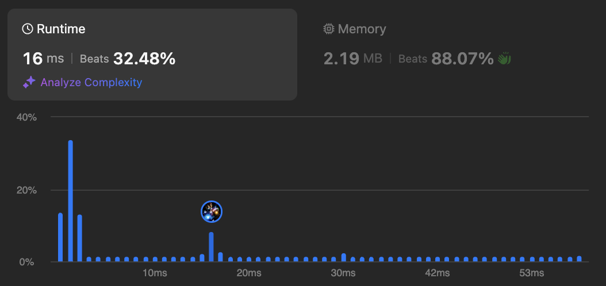

# Two Sum

## Description

<div align="center" >

</div>

## Solutions

<br />

**Solution-1:**

`Best Performance`

```javascript
use std::collections::HashMap;
pub fn two_sum(nums: Vec<i32>, target: i32) -> Vec<i32> {
    let mut map: HashMap<i32, i32> = HashMap::with_capacity(nums.len());
    for (k, &v) in nums.iter().enumerate() {
        match map.get(&v) {
            Some(&i) => {
                return vec![i as i32, k as i32];
            }
            None => {
                map.insert(target - &v, k as i32);
            }
        }
    }
    unreachable!()
}
```

<div align="center" >

</div>

<br />

**Solution-2:**

`Best Memory Usage`

```javascript
pub fn two_sum(nums: Vec<i32>, target: i32) -> Vec<i32> {
    let mut map: Vec<(i32, i32)> = Vec::new();
    for (k, &v) in nums.iter().enumerate() {
        match map.iter().position(|&(k1, _)| k1 == v) {
            Some(i) => {
                return vec![i as i32, k as i32];
            }
            None => {
                map.push((target - &v, k as i32));
            }
        }
    }
    unreachable!()
}
```

<div align="center" >

</div>

<br />

**Solution-3:**

`Best Solution`

```javascript
pub fn two_sum(nums: Vec<i32>, target: i32) -> Vec<i32> {
    let mut nums: Vec<(usize, i32)> = nums
        .into_iter()
        .enumerate()
        .collect::<Vec<(usize, i32)>>();
    nums.sort_unstable_by_key(|&(_, v)| v);
    for (i, (k, v)) in nums.iter().enumerate() {
        match nums[i + 1..].binary_search_by_key(&(target - *v), |&(_, b)| b) {
            Ok(j) => {
                return vec![*k as i32, nums[j + i + 1].0 as i32];
            }
            Err(_) => {}
        }
    }
    unreachable!();
}
```

<div align="center" >

</div>

<br />

