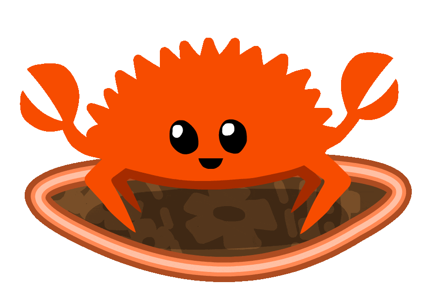
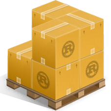

<div align="center" >





# <span>&nbsp;</span>  LeetCode Problems in RUST

LeetCode problems solved in Rust, optimized for the best performance and memory usage.
</div>

<br />

## Problems Solved

**Easy:** `0`

**Medium:** `0`

**Hard:** `0`

<br />

## Tech-Info

Rust: `1.78.0`

Cargo: `1.78.0`

<br />

<br />

## How to run Solo File

```sh
cd ./folder/ ;
rustc ./main.rs ;
./main ; 
```

## How to create Cargo Project

```sh
cargo new abc-project ;
```

## How to run Cargo Project

```sh
cd ./cargo-project/ ;
cargo clean ;
cargo run ;
```

<br />
